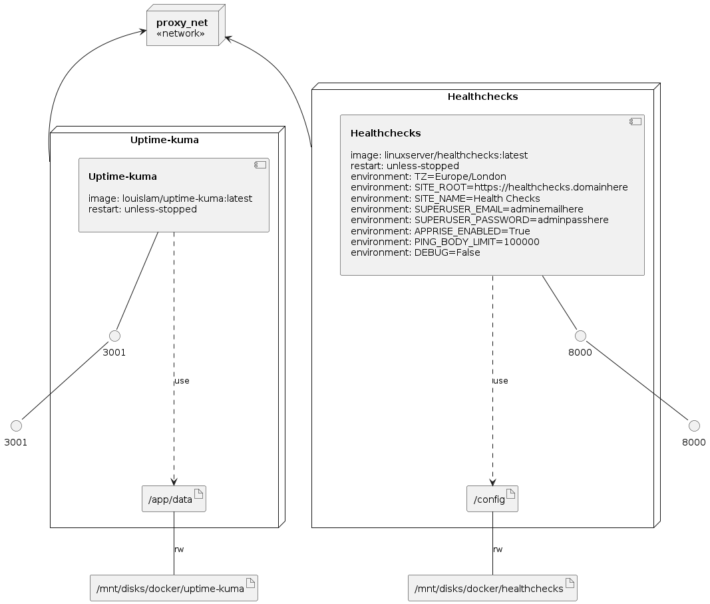

<p align="center">
  <a href="https://www.buymeacoffee.com/jharrison94">  

# Deploys an Ubuntu Minimal OS Virtual Machine with Docker-ce and Docker Compose installed in GCP using Terraform
Using the below instructions and supplied .tf files you will be able to deploy an e2-micro instance into GCP using Terraform, this is the free tier so shouldnt cost you a thing. This version comes with docker installed and will inject a compose file into the app data drive in /mnt/disks/docker/projects/app my example contains an Uptime Kuma and Healthchecks container.

# 🔧 IMPORTANT
I have moved all the installation instructions for this project over to my doc's site at [sudo-kraken Docs](https://sudo-kraken.github.io/docs/gcp-free-forever/) This contains everything you need to know and more to deploy this project.

Everything from this point down is deprecated in favor of the doc's page, I am leaving it in however for those of you who do not require a long and in-depth guide.

____

## Instructions
Firstly you will need to have a GCP account you can read more on this [here](https://cloud.google.com/free/docs/gcp-free-tier). Once this is done, go ahead and create yourself a blank project, name it whatever you like. Then enable the Compute Engine API, finally proceed to open up the google cloud shell from within that project.

Once in the cloud shell, make sure you are in /home/USERHERE
Create the folders required for your auth, tf,  and docker compose files. (You should automatically be in your home folder feel free to put these wherever you choose.)

- I made the folders in /home/USER.
  - All TF files go in the terraform folder.
  - docker-compose.yaml goes into compose_files
  - The auth command auto outputs into the /home/USER/auth folder
  - Finally the startup.sh goes into the startup folder.

```
cd ~/

mkdir terraform

mkdir auth

mkdir compose_files

mkdir startup

mkdir .ssh
```
Git clone this repo into the terraform folder and move the compose file into the compose_files folder, startup.sh into the startup folder.

You will also need to store a private and public key in your ~/.ssh folder and name them "sshkey" and "sshkey.pub", these should container your OpenSSH format keys, this will be what is added to the VM so that you can SSH in on the public interface to manage it.

Now you will need to create a service account to use Terraform with and give it all the required permissions necessary to provision the VM.

```
# Creates a service account named tf-serviceaccount 
gcloud iam service-accounts create tf-serviceaccount --description="service account for terraform" --display-name="terraform_service_account"

# List accounts to ensure it was created
gcloud iam service-accounts list

# Create keys for the service account to use when provisioning and store them in the auth folder.
**Ensure that you update PROJECT-ID-HERE with your project ID.**
gcloud iam service-accounts keys create ~/auth/google-key.json --iam-account tf-serviceaccount@PROJECT-ID-HERE.iam.gserviceaccount.com
```

With this done we will now add the following permissions to the service account.

```
gcloud services enable cloudresourcemanager.googleapis.com
gcloud services enable cloudbilling.googleapis.com
gcloud services enable iam.googleapis.com
gcloud services enable storage.googleapis.com
gcloud services enable serviceusage.googleapis.com

# For all of the below commands ensure that you update PROJECT-ID-HERE with your project ID.
gcloud projects add-iam-policy-binding PROJECT-ID-HERE --member serviceAccount:tf-serviceaccount@PROJECT-ID-HERE.iam.gserviceaccount.com --role roles/viewer

gcloud projects add-iam-policy-binding PROJECT-ID-HERE --member serviceAccount:tf-serviceaccount@PROJECT-ID-HERE.iam.gserviceaccount.com --role roles/storage.admin

gcloud projects add-iam-policy-binding PROJECT-ID-HERE --member serviceAccount:tf-serviceaccount@PROJECT-ID-HERE.iam.gserviceaccount.com --role roles/compute.instanceAdmin.v1

gcloud projects add-iam-policy-binding PROJECT-ID-HERE --member serviceAccount:tf-serviceaccount@PROJECT-ID-HERE.iam.gserviceaccount.com --role roles/compute.networkAdmin

gcloud projects add-iam-policy-binding PROJECT-ID-HERE --member serviceAccount:tf-serviceaccount@PROJECT-ID-HERE.iam.gserviceaccount.com --role roles/compute.securityAdmin
```

Now you will want to copy all of the .tf files in this repo into the terraform folder we created earlier, ensure you read all of them carefully and update each one with your own information.

You should now be ready to deploy. First you will run the init, to pull all dependancies, then a plan to test the config and finally apply to build the project.
```
terraform init

terraform plan

terraform apply
```

Voila! if all is well you should be presented with the information of your new vm. You can now SSH in via the public IP or go through the cloud console SSH which can be found in the GCP Compute Engine under VM Instances. It can take a couple of minutes to complete all the installations and file injection once the machine is up so give it a few minutes to process, it will all be there I promise.

By Default Google sets the VM networking to premium, so dont forget to go and change it to standard, as shown here.


____

### Notes
``` sh
.
├─ auth/                               # Folder to store the API user credentials
├─ compose_files/
│  └─ docker-compose.yaml              # Docker compose configuration file
├─ startup/
│  └─ startup.sh                       # Startup script to install dependancies
└─ terraform/
   ├─ network-firewall.tf              # Network Firewall Rule Definitions
   ├─ network-main.tf                  # Network Definitions
   ├─ network-variables.tf             # Network Terraform Variable Definitions
   ├─ provider-main.tf                 # GCP Providers Definitions
   ├─ provider-variables.tf            # GCP Providers Terraform Variable Definitions
   ├─ terraform.tfvars                 # Terraform Variable Definitions
   ├─ ubnt-versions.tf                 # Ubuntu Version Definitions
   ├─ ubnt-vm-main.tf                  # Main VM Configuration Definitions
   ├─ ubnt-vm-output.tf                # Information To Display When Provisioning Completes
   └─ ubnt-vm-variables.tf             # Main VM Terraform Variable Definitions
```
### Google Free Tier Information
I have highlighted the key information in bold below.

**Compute Engine**
- 1 non-preemptible **e2-micro VM** instance per month in one of the following US regions:
    - Oregon: **us-west1**
    - Iowa: us-central1
    - South Carolina: us-east1
- 30 GB-months standard persistent disk**
- 5 GB-month snapshot storage** in the following regions:
    - Oregon: **us-west1**
    - Iowa: us-central1
    - South Carolina: us-east1
    - Taiwan: asia-east1
    - Belgium: europe-west1
- **1 GB network egress from North America to all region destinations** (excluding China and Australia) per month
- **Your Free Tier e2-micro instance limit is by time**, not by instance. Each month, eligible use of all of your e2-micro instance is free until you have used a number of hours equal to the total hours in the current month. Usage calculations are combined across the supported regions.

- **Compute Engine free tier does not charge for an external IP address.**

- GPUs and TPUs are not included in the Free Tier offer. You are always charged for GPUs and TPUs that you add to VM instances.


### Infrastructure model


